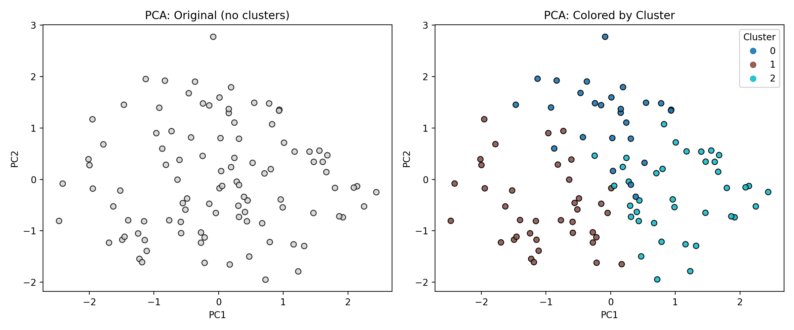
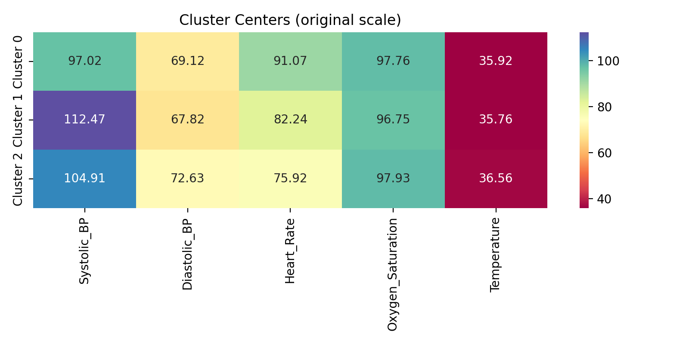

# Patient Segmentation by Vital Signs

## Project overview

This project demonstrates an unsupervised learning workflow for segmenting patients using common vital signs: systolic and diastolic blood pressure, heart rate, oxygen saturation, and temperature. It is intended as a clear, reproducible learning example for beginners interested in data cleaning, clustering, and result interpretation.

---

## Files at a glance

- `dataset/cleaned/aggregated_vitals_cleaned.csv` — cleaned and aggregated patient vitals
- `dataset/cleaned/scaled_features.npy` — standardized features used for clustering
- `notebooks/01_data_cleaning.ipynb` — data inspection, missing values, outliers, aggregation, scaling
- `notebooks/02_training_clustering.ipynb` — determine K (elbow), fit K‑Means, analyze clusters, save outputs
- `results/patient_clusters.csv` — patient rows with assigned `Cluster`
- `results/cluster_centers.csv` — cluster centers expressed in original units
- `results/segmentation_report.txt` — short textual summary
- `scripts/plot_comparison.py` — plots comparing original vs clustered data (writes `results/plots/`)

## Visual comparison (before vs after)

Below the key plots are embedded so you can quickly compare the raw distribution and the clustered segmentation.

<table>
  <tr>
    <td></td>
    <td></td>
  </tr>
  <tr>
    <td align="center">PCA projection: left shows original points, right shows the same projection colored by cluster</td>
    <td align="center">Boxplots: distribution of each vital by cluster</td>
  </tr>
</table>

Cluster centers heatmap: average values for each cluster in the original measurement units.

---

## Short guide to the code

- `01_data_cleaning.ipynb`:

  - Reads raw vitals, aggregates per subject, checks for missing data and outliers (IQR method), and saves cleaned data and scaled features.
  - Key outputs: `aggregated_vitals_cleaned.csv`, `scaled_features.npy`.
- `02_training_clustering.ipynb`:

  - Runs the elbow method (inertia) and computes silhouette/davies-bouldin scores for K choices.
  - Fits final `KMeans` model, assigns `Cluster` labels, computes cluster centers, and saves artifacts under `results/`.
- `scripts/plot_comparison.py`:

  - Loads `aggregated_vitals_cleaned.csv` and `patient_clusters.csv`, runs PCA for 2D visualization, produces boxplots by cluster, and saves images to `results/plots/`.

---

## Interpretation pointers

- Use `results/cluster_centers.csv` to summarize and describe cohorts.
- Look at boxplots to see which clusters have higher BP, HR, or other vitals.
- Remember: these clusters are descriptive. Clinical inference requires domain expertise and validation on external data.

---

## Next steps (optional)

- Add hierarchical clustering and a dendrogram for comparison.
- Add unit checks and explicit conversions where applicable.
- Add cross-validation of cluster stability or use different clustering algorithms.

---

If you want the README expanded further (short captions under each embedded figure, an interpretation paragraph for each cluster, or a one-page project summary for a portfolio), tell me which additions you'd like and I'll update it accordingly.
