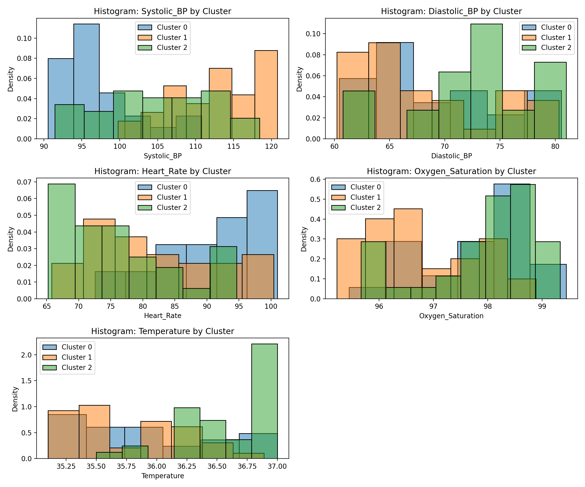
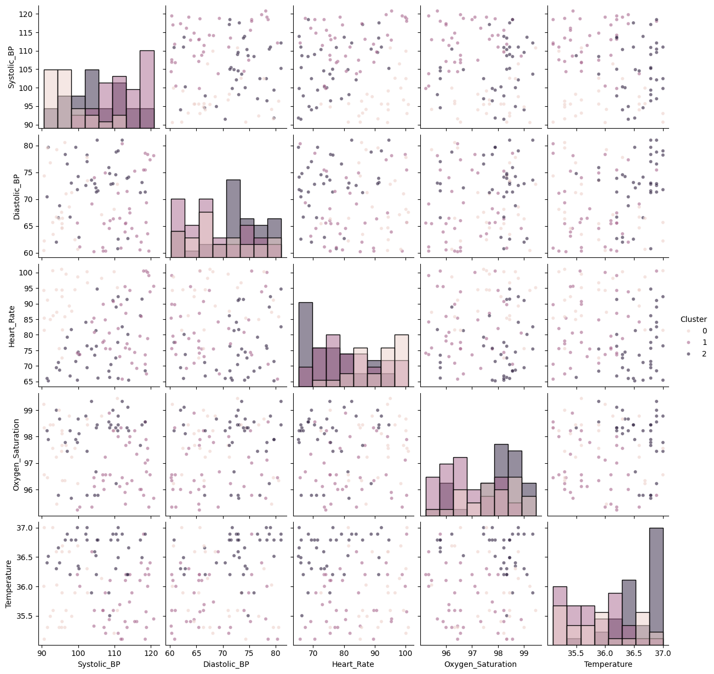
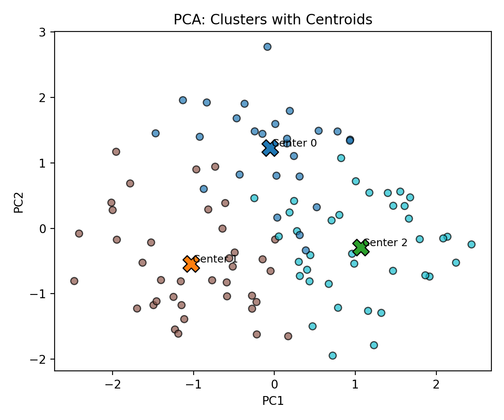
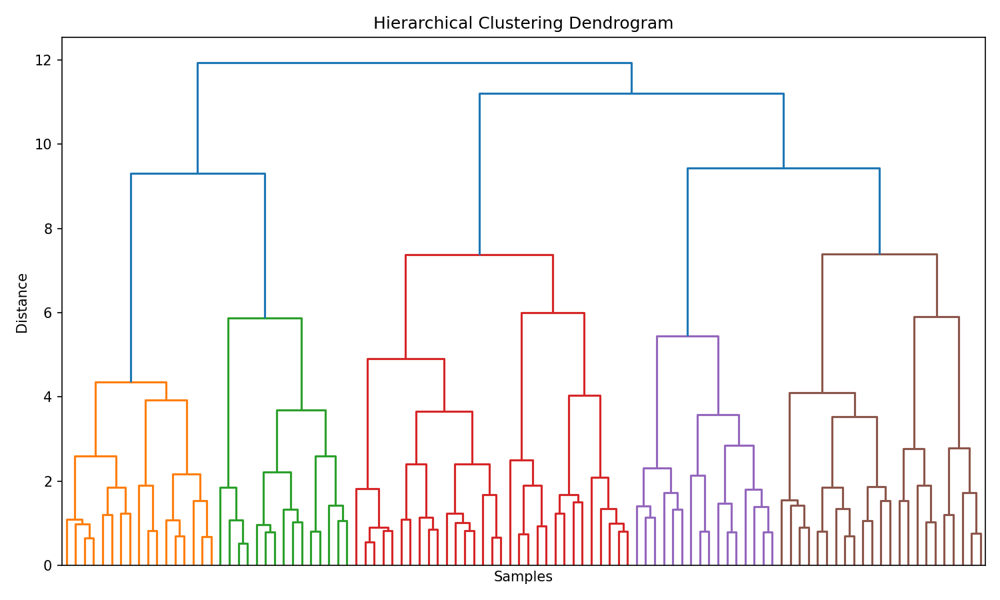
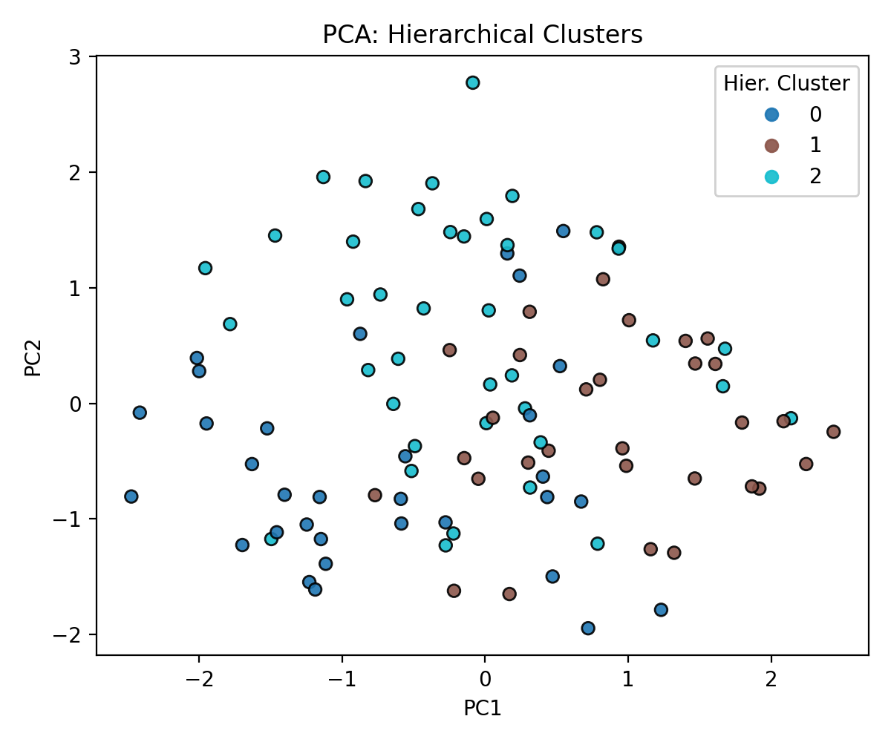
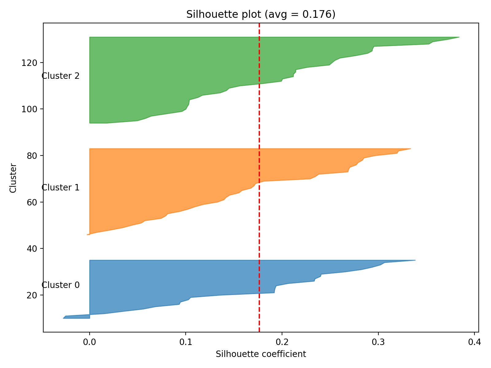
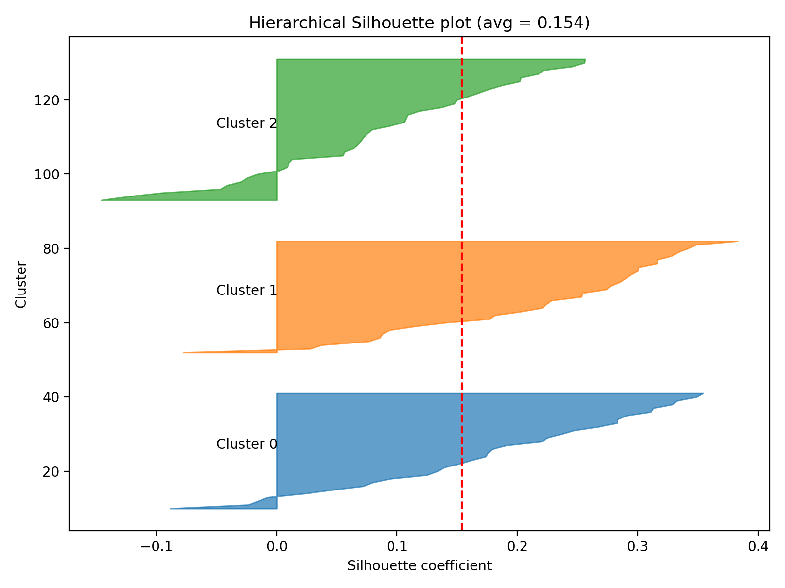

# Patient Segmentation by Vital Signs


# Patient Segmentation by Vital Signs

A concise, reproducible pipeline demonstrating how to segment patients using routine vital signs. This repository walks through data cleaning, feature scaling, clustering (K‑Means and Hierarchical), visualization, and cluster stability analysis — all with reproducible notebooks and scripts.

## 1. Project idea / Overview 

**Purpose:**

- Segment patients into clinically meaningful groups using common vital signs (systolic & diastolic blood pressure, heart rate, oxygen saturation, temperature).
- Provide an interpretable, reproducible workflow for exploratory cohort discovery and hypothesis generation.

**Why this is useful:**

- Clustering helps discover subgroups that may reflect different physiological states or care needs (e.g., hypertensive, tachycardic, febrile cohorts).
- These segments can guide monitoring, triage, or further downstream analysis (e.g., predictive modeling, targeted interventions).

**What insights to expect:**

- Profiles of clusters (e.g., "high BP, normal HR", "elevated HR and low SpO2").
- Visual separation or overlap of clusters in PCA or pairwise feature space.
- Quantitative metrics of cluster quality and stability (silhouette score, adjusted Rand index, bootstrap stability).

---

## 2. Dataset description 

**Included data (example dataset in this repo):**

- Features: `Systolic_BP` (mmHg), `Diastolic_BP` (mmHg), `Heart_Rate` (bpm), `Oxygen_Saturation` (%), `Temperature` (°C).
- Size: Example dataset is a small cohort (102 samples) included under `dataset/cleaned/aggregated_vitals_cleaned.csv` and the scaled features in `dataset/cleaned/scaled_features.npy`.
- Source: provided as an anonymized example. Replace with your real or synthetic data as needed and document the source when using real patient data.

**Preprocessing steps performed:**

- Missing values inspection and handling (drop or impute depending on context; see `notebooks/01_data_cleaning.ipynb`).
- Outlier detection (IQR-based checks) and optional capping/removal.
- Feature scaling (StandardScaler used for PCA and clustering) to avoid domination by larger-scale features.

---

## 3. Methodology / Code explanation

High-level steps and small code snippets:

1) Load cleaned data

```python
import pandas as pd
df = pd.read_csv('dataset/cleaned/aggregated_vitals_cleaned.csv')
X = df[['Systolic_BP','Diastolic_BP','Heart_Rate','Oxygen_Saturation','Temperature']].values
```

2) Preprocess (scaling)

```python
from sklearn.preprocessing import StandardScaler
scaler = StandardScaler()
X_scaled = scaler.fit_transform(X)
```

3) K‑Means: elbow method + silhouette

```python
from sklearn.cluster import KMeans
from sklearn.metrics import silhouette_score
inertias = []
sil_scores = []
for k in range(2, 11):
    km = KMeans(n_clusters=k, random_state=42, n_init=10).fit(X_scaled)
    inertias.append(km.inertia_)
    sil_scores.append(silhouette_score(X_scaled, km.labels_))
```

4) Fit final K‑Means and save labels

```python
km = KMeans(n_clusters=3, random_state=42, n_init=10).fit(X_scaled)
labels_k = km.labels_
df['Cluster'] = labels_k
df.to_csv('results/patient_clusters.csv', index=False)
```

5) Hierarchical clustering & dendrogram

```python
from scipy.cluster.hierarchy import linkage, dendrogram, fcluster
Z = linkage(X_scaled, method='ward')
# visualize with dendrogram(Z)
labels_hier = fcluster(Z, t=3, criterion='maxclust') - 1  # 0..k-1
```

6) Stability checks (bootstrap ARI)

```python
from sklearn.metrics import adjusted_rand_score
# For repeated bootstrap samples, compare reference labels with labels from a clustering fitted on the subsample
ari = adjusted_rand_score(labels_reference[subset], labels_subsample)
```

All of the above steps are implemented (and documented) in notebooks:

- `notebooks/01_data_cleaning.ipynb` — cleaning and scaling
- `notebooks/02_training_clustering.ipynb` — K‑Means analysis
- `notebooks/03_cluster_analysis.ipynb` — hierarchical clustering, dendrogram, stability checks

Scripts for reproducible runs are provided in `scripts/` (e.g., `scripts/cluster_analysis.py`, `scripts/plot_comparison.py`).

---

## 4. Visualization

Typical visualizations included in this repo and what they show:

- Pre-clustering:

  - Histograms / boxplots for each feature — check distributions and outliers.

    

  - Pairplots — bivariate relationships and marginal distributions.

    

- Post-clustering:

  - PCA projection colored by cluster (`results/plots/pca_original_vs_cluster.png`) — shows how clusters separate in 2D projection.

    

  - PCA with centroids annotated (`results/plots/pca_with_centroids.png`) — shows cluster centers in PCA space.

    

  - Cluster centers heatmap (`results/plots/cluster_centers_heatmap.png`) — mean feature values per cluster in original units.

    

  - Dendrogram (`results/plots/dendrogram.png`) — hierarchical structure and choice of cut height.

    

  - PCA: Hierarchical clusters (`results/plots/pca_hierarchical.png`) — hierarchical clusters plotted in PCA space.

    

  - Silhouette plots (`results/plots/silhouette_plot.png`, `silhouette_plot_hierarchical.png`) — per-cluster cohesiveness and separation.

    

    

Example code to produce a PCA colored scatter:

```python
from sklearn.decomposition import PCA
import matplotlib.pyplot as plt
pca = PCA(n_components=2).fit_transform(X_scaled)
plt.scatter(pca[:,0], pca[:,1], c=labels_k, cmap='tab10')
plt.title('PCA: Colored by KMeans cluster')
```

**Interpretation tips:**

- If clusters are cleanly separated in PCA space, it indicates a meaningful structure in the scaled features. Overlap suggests clusters are subtle or that more features/transformations are needed.
- Silhouette near +1 indicates well-separated clusters; near 0 indicates overlapping clusters.

---

## 5. Analysis & example results

The example run in this repository produced 3 clusters (see `results/cluster_centers.csv`). General observations from that run:

- Cluster patterns (example):

  - **Cluster 0:** Lower systolic BP, **higher heart rate** — might correspond to a tachycardic group.
  - **Cluster 1:** Highest systolic BP — possible hypertensive cohort.
  - **Cluster 2:** Intermediate BP values with slightly higher temperature in some cases.
- Quantified metrics: silhouette scores and bootstrap ARIs are saved in `results/cluster_stability.csv` to assess internal quality and stability across resampling.

**Applications of these insights:**

- Cohort discovery for targeted monitoring or triage.
- Feature selection and cohort-specific predictive modeling.
- Informing clinical studies to explore the relevance of derived clusters to outcomes.

> Important: These clusters are explanatory and dataset-dependent. Clinical validation and external datasets are required before using these segments for decisions.

---

## 6. Conclusion & future work 

**Summary:**

- The pipeline demonstrates how common vitals can define meaningful patient segments using unsupervised methods.
- We provide tools for visualization, stability checking, and interpretation to support reproducible analyses.

**Future improvements / extensions:**

- Cross-validate cluster stability with repeated subsampling or consensus clustering.
- Add time-series clustering to incorporate temporal changes in vitals.
- Integrate more features (laboratory values, demographics) and test supervised approaches for outcome prediction.
- Use external clinical datasets to validate cluster generalizability.

---

## Quick start — how to run

1. Create an environment and install dependencies (example):

```bash
python -m venv .venv
source .venv/bin/activate
pip install -r requirements.txt  # or pip install numpy pandas scipy scikit-learn matplotlib seaborn ipywidgets pytest
```

2. Run notebooks in order:

- `notebooks/01_data_cleaning.ipynb`  (clean + scale)
- `notebooks/02_training_clustering.ipynb`  (KMeans analysis)
- `notebooks/03_cluster_analysis.ipynb`  (hierarchical + stability)

3. Or run scripts:

- `python3 scripts/cluster_analysis.py`
- `python3 scripts/plot_comparison.py`

Outputs will be saved under `results/` and `results/plots/`.

---

## Files of interest 

- `dataset/cleaned/aggregated_vitals_cleaned.csv` — cleaned patient table
- `dataset/cleaned/scaled_features.npy` — features for clustering
- `results/patient_clusters.csv` — KMeans labels per patient
- `results/hierarchical_clusters.csv` — hierarchical cluster labels
- `results/cluster_centers.csv` — cluster centers in original units
- `results/cluster_stability.csv` — silhouette scores and bootstrap ARI stability
- `notebooks/*.ipynb` and `scripts/*.py` — analysis code
